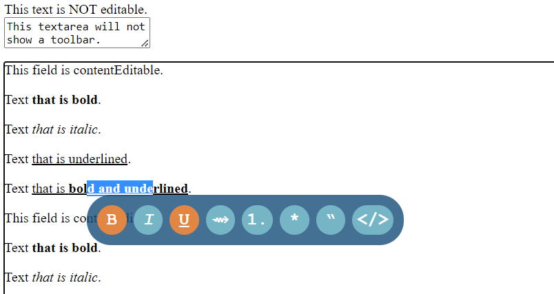

# ContentEditableToolbar
Adds a simple floating toolbar to [contentEditable](https://developer.mozilla.org/en-US/docs/Web/HTML/Global_attributes/contenteditable) elements, without the need to add any extra properties to your HTML code. As text is selected, the floating toolbar shows, allowing the user to format the selection. The toolbar displays the current formatting that is applied and follows the cursor. 

ContentEditableToolbar makes use of [execCommand](https://developer.mozilla.org/en-US/docs/Web/API/Document/execCommand) to enable and disable formatting.

# Screenshot



# Usage

Add below lines of code to your HTML. Adjust the optional setting object that is passed into  contentEditableToolbar` as desired.

```html
<script src="https://cdn.jsdelivr.net/gh/sjoerdvanderhoorn/contenteditabletoolbar/contenteditabletoolbar.js"></script>
<script>
window.addEventListener("load", function()
{
  // Minimal example:
  // contentEditableToolbar();

  // Example with own button selection:
	contentEditableToolbar(
	{
		buttons: [{code:"bold"}, {code:"italic"}, {code:"underline"}, {code:"link"}, {code:"ordered"}, {code:"unordered"}, {code:"quote"}, {code:"code"}]
	});
});
</script>
```

# Available formatting options

When calling the contentEditableToolbar function, an array of buttons can be defined. Each button requires a `code` in order for it to display. Buttons can be added in any order.

```json
{
  code: "",      // Required - Code of the button to add.
  content: "",   // Optional - HTML formatted string placed into the button.
  title: ""      // Optional - Title to show when hovering over the button.
}
```

ContentEditableToolbar does not include any icon package, but you can utilize an external package like for example [Font Awesome](https://fontawesome.com/v4/) by setting the `content` parameter to something like `"<i class=\"fa fa-link\"></i>"`. Also see [example.html](example.html) for more uses.

## Code options

* Decoration
  * `bold`
  * `italic`
  * `underline`
  * `strikethrough`
* Color
  * `color`
  * `background`
* Heading
  * `h1`
  * `h2`
  * `h3`
  * `h4`
  * `h5`
  * `h6`
* Interaction
  * `link`
* Lists
  * `ordered`
  * `unordered`
* Blocks
  * `quote`
  * `pre`
* Inline
  * `code`
* Alignment
  * `left`
  * `center`
  * `right`
  * `justify`
* Formatting
  * `unformat`

